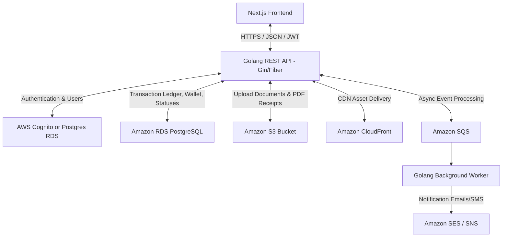
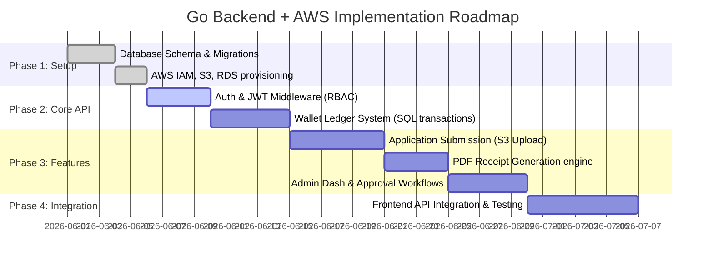

# E-Seva Dashboard Backend Specification
## Golang + AWS Architecture & Integration Guide

This document details the backend architecture, AWS infrastructure mapping, Golang application modules, and integration steps required to make the Next.js e-seva frontend fully functional.

---

## 1. System Architecture



---

## 2. AWS Infrastructure & Service Mapping

To make the site fully functional, secure, and production-ready, the following AWS services will be used:

| Service | Purpose | Specific Use Case |
| :--- | :--- | :--- |
| **Amazon RDS (PostgreSQL)** | Primary database | Storing relational data: Users, Roles, Transaction ledgers, Service application forms, Wallet histories. |
| **Amazon S3** | Object storage | Storing user-uploaded KYC documents (Aadhaar, PAN scans) and dynamically generated PDF receipts. |
| **Amazon CloudFront** | Content Delivery Network | Delivering PDF receipts and static files securely to retailers using signed URLs. |
| **Amazon Cognito** (Optional) | User Auth & Management | Managing user sign-up, sign-in, and JWT issuance (can also be handled in Go using PostgreSQL + JWT). |
| **Amazon SQS (Simple Queue Service)** | Message queue | Handling asynchronous operations like background status verification and notifications. |
| **Amazon SES (Simple Email Service)** | Email messaging | Sending transaction reports, password resets, and account activation notifications. |
| **AWS Secrets Manager** | Secure configuration | Storing database passwords, API credentials, AWS IAM secrets, and JWT signing keys. |

---

## 3. Core Backend Components to Develop in Go

Here is the checklist of Golang modules that must be built to support the e-seva frontend features:

### 3.1. Authentication & Role-Based Access Control (RBAC)
The site has multiple user levels (Admin, Distributor, Retailer, Customer).
*   **Authentication**: Secure login, register, and refresh token endpoints. Issue stateless JWTs containing user ID, role, and permissions.
*   **RBAC Middleware**: Middleware to intercept incoming requests and verify if the user's role has permission to execute the action (e.g., only Admin can approve a wallet top-up request; only Retailers can submit an Aadhaar update request).
*   **Audit Logging**: Every action (especially wallet adjustments and document access) must write an audit log into the database.

### 3.2. Wallet Management & Transaction Ledger (Critical)
The dashboard has a "Main Wallet", "API Wallet", and handles balance requests. Financial transactions require strict integrity.
*   **Database Schema**: A relational ledger structure where balance is *computed* or locked safely. Avoid race conditions (e.g. use `SELECT FOR UPDATE` or optimistic locking on updates).
*   **Endpoints Required**:
    *   `GET /api/wallet/balance` - Retrieve current balance.
    *   `POST /api/wallet/request` - Retailers request a top-up (input: amount, payment reference image upload).
    *   `GET /api/wallet/requests` - Admins list pending top-up requests.
    *   `POST /api/wallet/requests/:id/approve` - Admin approves top-up (credits main wallet, creates ledger record).
    *   `POST /api/wallet/deduct` - Deduct funds when a service application is submitted.
*   **Safety**: Implement Go mutexes or transactional database blocks to ensure no double-spending.

### 3.3. Service Applications & Status Tracking (`/status`, `/permission`)
Retailers submit applications (Aadhaar update, PAN card service, etc.) which go through a workflow (`Pending` -> `In Process` -> `Approved` / `Resubmit`).
*   **Service Configurations**: Database table detailing active services, their prices, and required documents.
*   **Multipart Upload handler**: Go endpoints to handle form submissions along with file uploads (KYC images/PDFs).
*   **S3 Integration**:
    *   Store files in an S3 bucket under structured paths: `kyc-documents/{user_id}/{application_id}/{filename}`.
    *   Files should be **private**. Generate temporary presigned URLs (valid for 5-10 minutes) when the Admin reviews the documents.
*   **Status Management**:
    *   `GET /api/applications` - List applications (with filtering by status, date, type).
    *   `POST /api/applications` - Submit an application (deducts application cost from wallet).
    *   `PATCH /api/applications/:id/status` - Admin updates status (e.g., changes to Approved, or marks as Resubmit with error notes).

### 3.4. PDF Generation Engine (`/pdf`)
Retailers require PDF receipts and application confirmation printouts.
*   **Engine**: Use a Go library such as `github.com/jung-kurt/gofpdf` or `github.com/johnfercher/maroto` to assemble application details into a formatted invoice/receipt PDF.
*   **Workflow**:
    1.  User clicks "Download Receipt" on the frontend.
    2.  Frontend calls `GET /api/applications/:id/receipt`.
    3.  Go backend fetches application details, generates the PDF in memory.
    4.  Saves the PDF to `Amazon S3` bucket (e.g., `receipts/{application_id}.pdf`).
    5.  Go returns a redirection to an S3 Presigned URL or streams the file bytes directly with `Content-Type: application/pdf`.

### 3.5. Payments Integration (`/payments`)
*   **Ledger & Gateways**: Integration with local/global payment processors (e.g. Razorpay, Stripe) for automated wallet top-ups.
*   **Webhooks**: A secure webhook handler `/api/payments/webhook` verifying signature from the payment gateway to instantly credit user wallets upon successful payment.

---

## 4. Proposed Golang Project Directory Structure

A clean, modular layout (Clean Architecture) is recommended for the Go backend:

```text
eservice-backend/
├── cmd/
│   └── api/
│       └── main.go             # Entry point of the Golang application
├── config/
│   └── config.go               # Configurations (AWS, DB, Port, JWT keys)
├── internal/
│   ├── auth/                   # Authentication logic
│   │   ├── handler.go
│   │   ├── service.go
│   │   └── repository.go
│   ├── wallet/                 # Wallet logic (credits, debits, ledgers)
│   │   ├── handler.go
│   │   ├── service.go
│   │   └── repository.go
│   ├── applications/           # E-seva applications (Aadhaar, PAN)
│   │   ├── handler.go
│   │   ├── service.go
│   │   └── repository.go
│   ├── middleware/             # CORS, JWT verification, RBAC
│   │   ├── auth.go
│   │   └── logger.go
│   └── platform/               # Direct connections to AWS and databases
│       ├── postgres/           # Database connections & migrations
│       ├── s3/                 # AWS S3 client wrapper
│       └── ses/                # AWS SES mail client
├── pkg/
│   └── pdfgen/                 # PDF generation utility helpers
├── go.mod
├── go.sum
└── .env.example
```

---

## 5. Step-by-Step Implementation Roadmap



---

## 6. How the Frontend Connects to this Backend

### 6.1. Environment Variables Configuration
In the Next.js frontend, configure the base API endpoint in `.env.local` (local development) or production settings:

```env
# Next.js Environment Variables
NEXT_PUBLIC_API_URL=http://localhost:8080/api/v1
```

### 6.2. Creating an API Client helper
Create a wrapper in `components/app/api.ts` or `lib/api.ts` to manage JWT headers automatically:

```typescript
const API_URL = process.env.NEXT_PUBLIC_API_URL || 'http://localhost:8080/api/v1';

export async function fetchWithAuth(endpoint: string, options: RequestInit = {}) {
  const token = localStorage.getItem('auth_token');
  
  const headers = {
    'Content-Type': 'application/json',
    ...(token ? { 'Authorization': `Bearer ${token}` } : {}),
    ...options.headers,
  };

  const response = await fetch(`${API_URL}${endpoint}`, {
    ...options,
    headers,
  });

  if (response.status === 401) {
    // Handle token expiration: Redirect to login page
    localStorage.removeItem('auth_token');
    window.location.href = '/login';
  }

  return response;
}
```

### 6.3. Example: Submitting an Aadhaar Update Request
Here is how the frontend component will send data to Go, which handles validation, S3 upload, and wallet debiting:

```typescript
async function submitAadhaarUpdate(formData: FormData) {
  // We use FormData instead of JSON to support uploading Aadhaar front/back scans
  const response = await fetch(`${API_URL}/applications/aadhaar`, {
    method: 'POST',
    headers: {
      'Authorization': `Bearer ${localStorage.getItem('auth_token')}`,
      // Do not set Content-Type header; browser automatically sets multipart/form-data with boundary
    },
    body: formData,
  });

  if (!response.ok) {
    const error = await response.json();
    throw new Error(error.message || 'Submission failed');
  }

  return await response.json();
}
```
